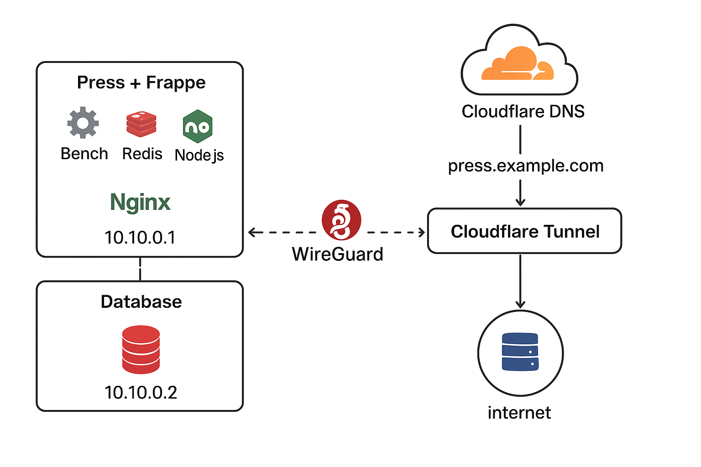

# Self-Hosted Frappe Cloud / Press Console on Ubuntu 22.04 LTS

This guide explains how to deploy **Frappe Cloud / Press Console** on two servers using **Ubuntu 22.04 LTS**, with secure private communication via **WireGuard**, and public access through **Cloudflare Tunnel**.  

It is designed for multiple companies/sites (e.g., 20 companies, ~300 users) and ensures security and scalability.


## 📦 Server Architecture

| Server | Role | Private IP (WireGuard) | Public Access |
|--------|------|------------------------|---------------|
| Press + Frappe + Redis | Application Server | 10.10.0.1 | Cloudflare Tunnel |
| Database | DB | 10.10.0.2 | None (private only) |

**Components:**
- Press + Frappe (Bench, Redis, Node.js, Nginx)
- MariaDB (DB server)
- Redis (DB caching)
- WireGuard VPN (private server communication)
- Cloudflare Tunnel (secure public access)
- Cloudflare DNS (domain mapping)


## 🌐 Prerequisites

- Two Ubuntu 22.04 LTS servers
- Root or sudo access
- Cloudflare account + API token
- Cloudflare Tunnel token

**Recommended resources (per server):**

| Role | CPU | RAM | Disk |
|------|-----|-----|------|
| Press + Frappe + Redis | 8 cores | 32 GB | 300 GB SSD |
| DB | 8 cores | 32 GB | 500 GB SSD |


## 🖥️ Step 1: Update Servers

```bash
sudo apt update && sudo apt upgrade -y
sudo apt install curl wget git unzip ufw -y
````

Enable firewall:

```bash
sudo ufw allow OpenSSH
sudo ufw enable
```
On both machines, make sure UDP port 51820 is open:

```bash
sudo ufw allow 51820/udp
sudo iptables -L -n -v
```

## 🔒 Step 2: Configure WireGuard Private Network

### Install WireGuard

```bash
sudo apt install wireguard -y
```

### Generate Keys

**Server 1 (Press + Frappe + Redis):**

```bash
cd /etc/wireguard
umask 077
wg genkey | tee server1.key | wg pubkey > server1.pub
```

**Server 2 (Database):**

```bash
cd /etc/wireguard
umask 077
wg genkey | tee server2.key | wg pubkey > server2.pub
```
**Read the keys:**
```bash

cat /etc/wireguard/server1.key
cat /etc/wireguard/server1.pub

```
Exchange **public keys** between servers.
---


### Configure WireGuard

**Server 1 (`/etc/wireguard/wg0.conf`):**

```ini
[Interface]
PrivateKey = <server1.key contents>
Address = 10.10.0.1/24
ListenPort = 51820

[Peer]
PublicKey = <server2.pub>
AllowedIPs = 10.10.0.2/32
```

**Server 2 (`/etc/wireguard/wg0.conf`):**

```ini
[Interface]
PrivateKey = <server2.key contents>
Address = 10.10.0.2/24

[Peer]
PublicKey = <server1.pub>
Endpoint = <SERVER1_PUBLIC_IP_OR_TUNNEL>:51820
AllowedIPs = 10.10.0.1/32
PersistentKeepalive = 25
```

Start WireGuard:

```bash
sudo systemctl enable wg-quick@wg0
sudo systemctl start wg-quick@wg0
```

Test connectivity:

```bash
ping -c 4 10.10.0.2  # from Press server
ping -c 4 10.10.0.1  # from DB server
```

---

## 🧰 Step 3: Database Server Setup (Server 2)

### Install MariaDB and Redis

```bash
sudo apt install mariadb-server mariadb-client redis-server -y
sudo systemctl enable mariadb redis-server --now
```

### Secure MariaDB

```bash
sudo mysql_secure_installation
```

Create Frappe DB user (restricted to WireGuard network):

```sql
CREATE DATABASE frappe_db;
CREATE USER 'frappe_user'@'10.10.0.1' IDENTIFIED BY 'StrongPassword123!';
GRANT ALL PRIVILEGES ON frappe_db.* TO 'frappe_user'@'10.10.0.1';
FLUSH PRIVILEGES;
EXIT;
```

Bind MariaDB to all interfaces (private network):

```bash
sudo nano /etc/mysql/mariadb.conf.d/50-server.cnf
# Change bind-address to:
bind-address = 0.0.0.0
sudo systemctl restart mariadb
```

---

## ⚙️ Step 4: Press + Frappe + Redis Server Setup (Server 1)

### Install Dependencies

```bash
sudo apt install python3-venv python3-pip redis-server wkhtmltopdf supervisor nginx nodejs npm -y
```

### Install Bench CLI

```bash
pip3 install --upgrade pip setuptools wheel
pip3 install frappe-bench
bench --version
```

---

### Initialize Bench

```bash
bench init press-bench --frappe-branch version-15
cd press-bench
```

---

### Create New Site

```bash
bench new-site press.local
# When prompted, use:
# DB Host: 10.10.0.2
# DB User: frappe_user
# DB Password: StrongPassword123!
```

Install Press app:

```bash
bench get-app https://github.com/frappe/press.git
bench --site press.local install-app press
```

---

### Configure Environment (`sites/common_site_config.json`)

```json
{
  "db_host": "10.10.0.2",
  "db_port": 3306,
  "db_name": "frappe_db",
  "db_user": "frappe_user",
  "db_password": "StrongPassword123!"
}
```

---

## 🌐 Step 5: Cloudflare Tunnel

1. Install Cloudflare Tunnel Docker container:

```bash
sudo docker run -d --name cloudflared --restart always \
  cloudflare/cloudflared:latest tunnel --no-autoupdate run --token <YOUR_TUNNEL_TOKEN>
```

2. Configure tunnel (`/etc/cloudflared/config.yml`):

```yaml
tunnel: <TUNNEL_ID>
credentials-file: /etc/cloudflared/<TUNNEL_ID>.json
ingress:
  - hostname: press.example.com
    service: http://localhost:8000
  - service: http_status:404
```

3. Restart tunnel:

```bash
sudo systemctl restart cloudflared
```

---

## ✅ Step 6: Verify Setup

* WireGuard connectivity:

  ```bash
  sudo wg show
  ```
* Press containers running:

  ```bash
  bench --site press.local start
  ```
* Database connectivity from Press server:

  ```bash
  mysql -h 10.10.0.2 -u frappe_user -p
  ```
* Access Press dashboard via Cloudflare:
  `https://press.example.com`

---

## ⚡ Optional Enhancements

* Enable **Fail2Ban**:

```bash
sudo apt install fail2ban -y
sudo systemctl enable fail2ban --now
```

* Restrict firewall:

```bash
sudo ufw allow 22
sudo ufw allow 51820/udp
sudo ufw deny 3306   # DB only via WireGuard
```

* Setup automatic **Backups & Restore scripts** for MariaDB and Frappe sites.

---

### References

* [Frappe Bench GitHub](https://github.com/frappe/bench)
* [Press App GitHub](https://github.com/frappe/press)
* [Cloudflare Tunnel Docs](https://developers.cloudflare.com/cloudflare-one/connections/connect-apps/)

### Diagram image showing the two-server architecture with WireGuard + Cloudflare Tunnel



